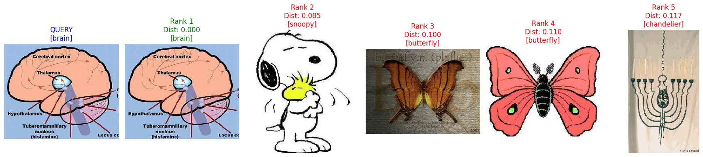
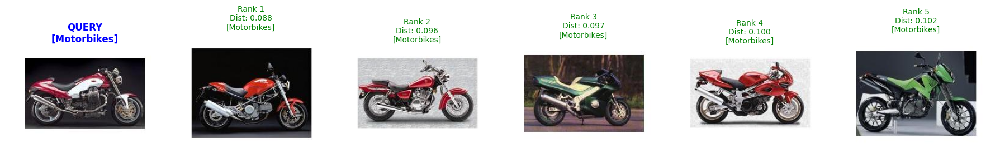

# Introduction
Hi this is mohammad. As my Computer vision and image processing course in university we were obligated to make a content based image retrieval system which is finding relevant images based on user's image query. The important think to mention is that during the course we were not allowed to used deep learning only traditional image processing techniques were allowed.
In this Repo first we will have the traditional method and than deep learning is added at the end to show the difference.

# Use cases of Content Based Image Retrieval
One of the most important uses of CBIR is in search engines. For example you see a beautiful glass in a store but the price is not acceptable for you. You know if you buy it from online stores like Amazon or the Iranian version 'Digikala' it will be much cheaper than the store and saves your money. What will you do ? Describe it? Describing is a good solution but there is no guarantee that finds you the exact glass you are looking for and all of the search engines doesn't support describing. The Easiest and the most accurate solution is searching via image. You take a picture of that glass and you see dozens of that glass and similar ones. That's it.
Well done. Know you can buy it.

Here are other CBIR applications :

- **Medical Imaging & Healthcare**
  - Retrieving similar medical images (MRI, CT scans) for diagnosis
  - Disease detection by comparing with previous cases

- **Security & Surveillance**
  - Face recognition and person identification
  - Searching for criminal or illegal content
  - Analyzing surveillance footage for specific targets
  - Visual identity verification

- **Media, Entertainment & Archives**
  - Fast retrieval from large photo/video libraries
  - News and journalism image sourcing
  - Similar content search on Instagram, Flickr, YouTube
  - Copyright infringement and plagiarism detection

- **Agriculture & Environment**
  - Plant disease detection via leaf image comparison
  - Satellite image retrieval for land change analysis
  - Automatic species classification (animals/plants)

- **Industry & Quality Control**
  - Automated visual inspection for defect detection
  - Predictive maintenance through equipment imaging
  - Robotics navigation and object recognition

- **Education & Research**
  - Digital libraries for scientific, historical, or artistic images
  - Art research and style analysis

- **Multimodal Search**
  - CLIP and Vision-Language models for combined text-image search
  - Text-to-image retrieval (e.g., "a dog running in snow")

# Key Advantages
  - Independent of manual labeling
  - Scalable for large data volumes
  - Visual search without verbal description
  - High accuracy with Deep Learning

# Dataset
I used "imbikramsaha/caltech-101" from kaggle which contains 101 classes totally 8677 of images like planes, motorcycles and etc.

## Classical CBIR: SIFT + Bag of Visual Words + TF-IDF

1. **Feature Extraction**  
   SIFT descriptors are extracted from each image. Each descriptor is a 128-dimensional vector representing a visual pattern. Images with fewer than 15 keypoints are discarded.

2. **Visual Vocabulary Construction**  
   All SIFT descriptors from the dataset are collected and clustered using **K-Means** with `K = 100`. The set of 100 centroids forms the **visual vocabulary**.

3. **Quantization & BoVW Histogram**  
   Each SIFT descriptor is assigned to its nearest visual word. For every image, we count how many times each visual word appears, producing a **100-dimensional histogram** (the BoVW representation).  
   This histogram captures the frequency of patterns.

4. **TF-IDF Weighting**  
   The raw histograms are weighted using **TF-IDF** . This downweights common visual words and emphasizes rare, discriminative ones. Vectors are L2-normalized.

5. **Retrieval**  
   Given a query image, its BoVW histogram is computed and weighted with the same TF-IDF transformer. Similar images are retrieved by ranking database images using **cosine distance**.

### Why BoVW?

- Produces a fixed-length vector for every image, enabling efficient comparison.
- Does not require labeled data for vocabulary construction.
- Captures the distribution of local patterns, making it robust to small variations.
- Can be accelerated with FAISS for large-scale retrieval.

### Limitations

- Loses spatial information .
- Performance depends on the choice of `K` and the quality of SIFT keypoints.

### Evaluation of Traditional Method

| Metric | Score |
|--------|-------|
| Mean Precision@5 | **28.51%** |
| Mean Average Precision (mAP) | **29.34%** |

## Deep Learning CBIR: ResNet50

In addition to the classical approach, a deep learning pipeline is implemented using a pre-trained **ResNet50** model. The last fully connected layer is removed, and each image is encoded as a 2048-dimensional feature vector. Retrieval is performed using cosine distance.

### Evaluation of Deep Learning Method
The deep model was evaluated on a random sample of 300 images with `top_k = 5`:

| Metric | Score |
|--------|-------|
| Mean Precision@5 | **88.33%** |
| Mean Average Precision (mAP) | **85.43%** |

